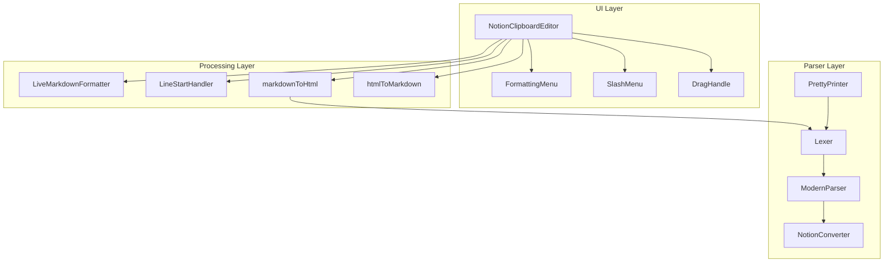

# Design Document: NotionClipboardEditor Improvements

## Overview

Ce document décrit l'architecture et le design des améliorations du NotionClipboardEditor. L'objectif est de créer une expérience d'édition fidèle à Notion avec support complet du Markdown en temps réel, tous les types de blocs, et une manipulation intuitive du contenu.

## Architecture



## Components and Interfaces

### 1. NotionClipboardEditor (Enhanced)

Le composant principal d'édition avec les nouvelles fonctionnalités.

```typescript
interface NotionClipboardEditorProps {
  // Existing props
  content: string;
  onChange: (content: string) => void;
  onBlocksChange?: (blocks: NotionBlock[]) => void;
  
  // Clipboard sync props
  clipboardContent?: string;
  hasUserEdited?: boolean;
  onResetToClipboard?: () => void;
  
  // Media props
  images?: ClipboardImage[];
  attachedFiles?: AttachedFile[];
  onFilesAdd?: (files: AttachedFile[]) => void;
  
  // Quota props
  fileQuotaRemaining?: number | null;
  maxFileSize?: number;
  
  // New: Live formatting
  enableLiveMarkdown?: boolean;
  enableSlashCommands?: boolean;
  enableDragDrop?: boolean;
}
```

### 2. LiveMarkdownFormatter

Module pour le formatage Markdown en temps réel.

```typescript
interface LiveMarkdownFormatter {
  // Detect and apply inline formatting
  processInlineFormatting(text: string, cursorPosition: number): {
    newText: string;
    newCursorPosition: number;
    applied: boolean;
  };
  
  // Patterns to detect
  patterns: {
    bold: RegExp;      // **text**
    italic: RegExp;    // *text*
    code: RegExp;      // `text`
    strike: RegExp;    // ~~text~~
    link: RegExp;      // [text](url)
  };
}
```

### 3. LineStartHandler

Module pour les raccourcis en début de ligne.

```typescript
interface LineStartHandler {
  // Detect and convert line-start shortcuts
  processLineStart(line: string): {
    blockType: BlockType;
    content: string;
    converted: boolean;
  };
  
  // Shortcut mappings
  shortcuts: Map<string, BlockType>;
}

type BlockType = 
  | 'paragraph' | 'heading_1' | 'heading_2' | 'heading_3'
  | 'bulleted_list' | 'numbered_list' | 'todo'
  | 'toggle' | 'quote' | 'divider' | 'callout';
```

### 4. SlashMenu

Composant pour le menu de commandes `/`.

```typescript
interface SlashMenuProps {
  show: boolean;
  position: { x: number; y: number };
  filter: string;
  onSelect: (command: SlashCommand) => void;
  onClose: () => void;
}

interface SlashCommand {
  id: string;
  name: string;
  description: string;
  icon: React.ReactNode;
  type: 'block' | 'action' | 'color';
  execute: () => void;
}
```

### 5. PrettyPrinter

Module pour convertir l'AST en Markdown (round-trip).

```typescript
interface PrettyPrinter {
  print(nodes: ASTNode[]): string;
  printNode(node: ASTNode, indent: number): string;
}
```

## Data Models

### Block Types

```typescript
type NotionBlockType =
  // Basic blocks
  | 'paragraph' | 'heading_1' | 'heading_2' | 'heading_3'
  | 'bulleted_list_item' | 'numbered_list_item' | 'to_do'
  | 'toggle' | 'quote' | 'divider' | 'callout'
  // Media blocks
  | 'image' | 'video' | 'audio' | 'file' | 'code' | 'bookmark'
  // Embed blocks
  | 'embed' | 'pdf'
  // Advanced blocks
  | 'equation' | 'table' | 'table_row';
```

### Callout Types

```typescript
type CalloutType = 'note' | 'info' | 'tip' | 'warning' | 'danger' | 'success' | 'default';

const CALLOUT_CONFIG: Record<CalloutType, { icon: string; color: string }> = {
  note: { icon: '📝', color: 'blue_background' },
  info: { icon: 'ℹ️', color: 'blue_background' },
  tip: { icon: '💡', color: 'green_background' },
  warning: { icon: '⚠️', color: 'yellow_background' },
  danger: { icon: '🚨', color: 'red_background' },
  success: { icon: '✅', color: 'green_background' },
  default: { icon: '💡', color: 'gray_background' },
};
```

### Inline Formatting Patterns

```typescript
const INLINE_PATTERNS = {
  bold: /\*\*([^*]+)\*\*$/,
  italic: /(?<!\*)\*([^*]+)\*$/,
  code: /`([^`]+)`$/,
  strikethrough: /~~([^~]+)~~$/,
  link: /\[([^\]]+)\]\(([^)]+)\)$/,
};

const LINE_START_PATTERNS = {
  bulletList: /^[-*+]\s/,
  numberedList: /^(\d+|[a-z]|[i]+)\.\s/,
  todo: /^\[\s?\]/,
  todoChecked: /^\[x\]/i,
  heading1: /^#\s/,
  heading2: /^##\s/,
  heading3: /^###\s/,
  toggle: /^>\s(?!\[!)/,
  quote: /^"\s/,
  divider: /^---$/,
  callout: /^>\s\[!(\w+)\]/,
};
```

## Correctness Properties

*A property is a characteristic or behavior that should hold true across all valid executions of a system-essentially, a formal statement about what the system should do. Properties serve as the bridge between human-readable specifications and machine-verifiable correctness guarantees.*

### Property 1: Reset button visibility matches edit state
*For any* content state where `hasUserEdited` is true AND `content !== clipboardContent`, the reset button SHALL be visible. Conversely, when `hasUserEdited` is false, the reset button SHALL be hidden.
**Validates: Requirements 1.1, 1.3**

### Property 2: Reset restores clipboard content
*For any* editor state with edited content, clicking reset SHALL result in `content === clipboardContent`.
**Validates: Requirements 1.2**

### Property 3: Clipboard sync when not edited
*For any* clipboard update when `hasUserEdited` is false, the displayed content SHALL equal the new clipboard content.
**Validates: Requirements 1.4**

### Property 4: Block transformation produces correct markup
*For any* block transformation action (bullet, numbered, todo, heading), the resulting HTML SHALL contain the appropriate markup elements (ul/li, ol/li, checkbox input, h1/h2/h3).
**Validates: Requirements 2.1, 2.2, 2.3, 13.4**

### Property 5: Consecutive empty lines are limited
*For any* markdown input, the `markdownToHtml` output SHALL NOT contain more than 2 consecutive `<p><br></p>` or empty paragraph elements.
**Validates: Requirements 3.1, 3.2**

### Property 6: File blocks contain required information
*For any* attached file, the rendered HTML SHALL contain the file name, file size, and an icon or preview.
**Validates: Requirements 5.2**

### Property 7: File quota validation
*For any* file addition when `fileQuotaRemaining === 0`, the `onFileQuotaExceeded` callback SHALL be invoked.
**Validates: Requirements 5.4, 14.3, 14.4**

### Property 8: Toggle vs Quote distinction
*For any* input with single `>` followed by space (not `[!`), the Lexer SHALL produce a TOGGLE token. For `>>`, it SHALL produce a QUOTE_BLOCK token.
**Validates: Requirements 6.1, 6.4**

### Property 9: Toggle list renders as details element
*For any* toggle list block, the rendered HTML SHALL contain a `<details>` element with a `<summary>` child.
**Validates: Requirements 6.2**

### Property 10: Code blocks have language attribute
*For any* code block with a specified language, the rendered HTML SHALL contain a `data-language` attribute or language-specific class.
**Validates: Requirements 7.1**

### Property 11: Inline code has distinct styling
*For any* inline code (backtick-wrapped), the rendered HTML SHALL contain a `<code>` element.
**Validates: Requirements 7.3**

### Property 12: Inline equations wrapped for MathJax
*For any* inline equation (`$$formula$$`), the `markdownToHtml` output SHALL contain a span with class `notion-equation-inline`.
**Validates: Requirements 8.1**

### Property 13: Block equations wrapped for MathJax
*For any* block equation (`$\n formula \n$`), the `markdownToHtml` output SHALL contain a div with class `notion-equation`.
**Validates: Requirements 8.2**

### Property 14: CSV detection produces table tokens
*For any* input with 2+ consecutive lines containing comma-separated values, the Lexer SHALL produce TABLE_ROW tokens with `tableType: 'csv'`.
**Validates: Requirements 9.1**

### Property 15: TSV detection produces table tokens
*For any* input with 2+ consecutive lines containing tab-separated values, the Lexer SHALL produce TABLE_ROW tokens with `tableType: 'tsv'`.
**Validates: Requirements 9.2**

### Property 16: Tables render with proper structure
*For any* table block, the rendered HTML SHALL contain `<table>`, `<thead>`, `<tbody>`, `<th>`, and `<td>` elements.
**Validates: Requirements 9.3**

### Property 17: Markdown images convert to img tags
*For any* markdown image syntax ``, the `markdownToHtml` output SHALL contain an `` tag with matching `src` and `alt` attributes.
**Validates: Requirements 10.1**

### Property 18: Image URLs convert to img tags
*For any* standalone URL ending in image extension (jpg, png, gif, webp, svg), the `markdownToHtml` output SHALL contain an `` tag.
**Validates: Requirements 10.2**

### Property 19: HTML list conversion preserves structure
*For any* HTML with `<ul>/<ol>/<li>` elements, the `htmlToMarkdown` output SHALL contain equivalent markdown list markers (`-` or `1.`).
**Validates: Requirements 11.2**

### Property 20: HTML formatting conversion
*For any* HTML with `<strong>`, `<em>`, `<code>` elements, the `htmlToMarkdown` output SHALL contain equivalent markdown syntax (`**`, `*`, backticks).
**Validates: Requirements 11.3**

### Property 21: Callout parsing extracts type and content
*For any* input with `> [!type] content` syntax, the Lexer SHALL produce a CALLOUT token with correct `calloutType` and `content` metadata.
**Validates: Requirements 12.1**

### Property 22: Callout rendering includes icon and color
*For any* callout block, the rendered HTML SHALL contain the appropriate emoji icon and background color class based on callout type.
**Validates: Requirements 12.2, 12.3**

### Property 23: File size validation
*For any* file with `size > maxFileSize`, the file SHALL be rejected and `showNotification` SHALL be called with an error message.
**Validates: Requirements 14.2**

### Property 24: Valid files are added to attachedFiles
*For any* file passing size and quota validation, the file SHALL be added to the `attachedFiles` array via `onFilesAdd`.
**Validates: Requirements 14.5**

### Property 25: Pretty printer round-trip consistency
*For any* valid markdown input, `prettyPrint(parse(input))` SHALL produce output that, when parsed again, yields semantically equivalent AST nodes.
**Validates: Requirements 15.2**

### Property 26: Pretty printer preserves list indentation
*For any* AST with nested list items, the pretty printer output SHALL contain appropriate indentation (spaces/tabs) to preserve hierarchy.
**Validates: Requirements 15.3**

### Property 27: Live bold formatting
*For any* text ending with `**word**` followed by space/continuation, the formatter SHALL convert it to `<strong>word</strong>` and remove the asterisks.
**Validates: Requirements 16.1**

### Property 28: Live italic formatting
*For any* text ending with `*word*` (not `**`) followed by space/continuation, the formatter SHALL convert it to `<em>word</em>` and remove the asterisks.
**Validates: Requirements 16.2**

### Property 29: Live code formatting
*For any* text ending with backtick-word-backtick followed by space/continuation, the formatter SHALL convert it to `<code>word</code>` and remove the backticks.
**Validates: Requirements 16.3**

### Property 30: Live strikethrough formatting
*For any* text ending with `~~word~~` followed by space/continuation, the formatter SHALL convert it to `<s>word</s>` and remove the tildes.
**Validates: Requirements 16.4**

### Property 31: Live link formatting
*For any* text containing `[text](url)`, the formatter SHALL convert it to `<a href="url">text</a>`.
**Validates: Requirements 16.5**

### Property 32: Line-start bullet list shortcut
*For any* line starting with `-`, `*`, or `+` followed by space, the handler SHALL convert it to a bulleted list item.
**Validates: Requirements 17.1**

### Property 33: Line-start todo shortcut
*For any* line starting with `[]` or `[ ]`, the handler SHALL convert it to a to-do checkbox.
**Validates: Requirements 17.2**

### Property 34: Line-start numbered list shortcut
*For any* line starting with `1.`, `a.`, or `i.` followed by space, the handler SHALL convert it to a numbered list item.
**Validates: Requirements 17.3**

### Property 35: Line-start heading shortcuts
*For any* line starting with `#`, `##`, or `###` followed by space, the handler SHALL convert it to the corresponding heading level.
**Validates: Requirements 17.4, 17.5, 17.6**

### Property 36: Line-start toggle shortcut
*For any* line starting with `>` followed by space (not `[!`), the handler SHALL convert it to a toggle list.
**Validates: Requirements 17.7**

### Property 37: Line-start quote shortcut
*For any* line starting with `"` followed by space, the handler SHALL convert it to a quote block.
**Validates: Requirements 17.8**

### Property 38: Line-start divider shortcut
*For any* line containing only `---`, the handler SHALL insert a divider.
**Validates: Requirements 17.9**

### Property 39: Slash menu filter
*For any* filter string after `/`, the menu SHALL display only commands whose name or keywords contain the filter string (case-insensitive).
**Validates: Requirements 18.2**

### Property 40: Block type rendering
*For any* basic block type (paragraph, heading, list, toggle, quote, divider, callout), the rendered HTML SHALL contain the appropriate semantic elements.
**Validates: Requirements 19.1-19.8**

### Property 41: Media block rendering
*For any* media block (image, video, audio, file, code, bookmark), the rendered HTML SHALL contain appropriate elements for that media type.
**Validates: Requirements 20.1-20.6**

## Error Handling

### File Upload Errors
- Size exceeded: Display notification with max size info
- Quota exceeded: Display upgrade prompt or quota warning
- Invalid type: Display supported types message
- Network error: Display retry option

### Parsing Errors
- Invalid markdown: Fall back to plain text paragraph
- Malformed HTML: Sanitize and convert what's possible
- Missing closing tags: Auto-close at end of content

### MathJax Errors
- Script load failure: Display raw LaTeX
- Typeset error: Display raw LaTeX with error indicator

## Testing Strategy

### Dual Testing Approach

This feature requires both unit tests and property-based tests:

1. **Unit Tests**: Verify specific examples and edge cases
2. **Property-Based Tests**: Verify universal properties across all inputs

### Property-Based Testing Framework

Use **fast-check** for TypeScript property-based testing.

```typescript
import * as fc from 'fast-check';
```

### Test Configuration

- Minimum 100 iterations per property test
- Use shrinking to find minimal failing examples
- Tag each test with the property it validates

### Test Categories

1. **Parser Tests** (Properties 8, 14, 15, 21)
   - Lexer token generation
   - AST node creation
   - Table detection

2. **Converter Tests** (Properties 17, 18, 19, 20)
   - Markdown to HTML conversion
   - HTML to Markdown conversion
   - Round-trip consistency

3. **Formatter Tests** (Properties 27-31)
   - Live inline formatting
   - Pattern detection and replacement

4. **Handler Tests** (Properties 32-38)
   - Line-start shortcut detection
   - Block type conversion

5. **Validation Tests** (Properties 7, 23, 24)
   - File size validation
   - Quota validation
   - Error notification

6. **Rendering Tests** (Properties 4, 9, 10, 11, 16, 22, 40, 41)
   - HTML structure verification
   - CSS class presence
   - Attribute correctness

### Test File Structure

```
packages/
├── notion-parser/
│   └── src/
│       └── __tests__/
│           ├── Lexer.test.ts
│           ├── Lexer.property.test.ts
│           ├── ModernParser.test.ts
│           ├── ModernParser.property.test.ts
│           ├── PrettyPrinter.test.ts
│           └── PrettyPrinter.property.test.ts
└── ui/
    └── src/
        └── components/
            └── editor/
                └── __tests__/
                    ├── NotionClipboardEditor.test.tsx
                    ├── NotionClipboardEditor.property.test.tsx
                    ├── LiveMarkdownFormatter.test.ts
                    ├── LiveMarkdownFormatter.property.test.ts
                    ├── LineStartHandler.test.ts
                    └── LineStartHandler.property.test.ts
```
